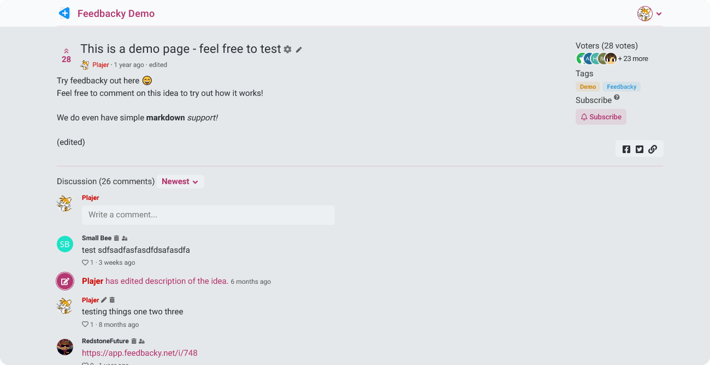
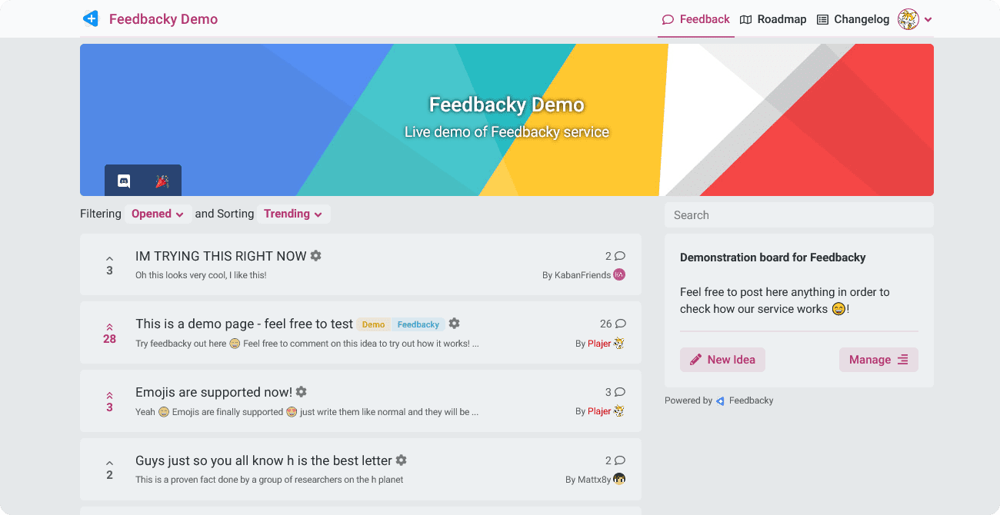

# Introduction

    

## Understand your users' needs.

Collect feedback from people easily while also improving your business with Feedbacky, a free and open-source software.

 

**​Consider leaving a ⭐️ in our** [**repository**](https://github.com/feedbacky-project/app) **if you enjoy Feedbacky!**

### Getting Started

Interested in having your own Feedbacky instance? Awesome! There are two ways that you can proceed.

**1. Cloud-hosted**

The simplest way to get started with using Feedbacky, all you have to do is create a board and we will handle the hosting.



Currently, cloud-hosted instances are entirely free with some quota limitations, you can read more about that [here](https://feedbacky.net/#pricing).

**2. Self-hosted**

Host Feedbacky on your own hardware or with a Virtual Private Server (VPS). We have a complete guide covering the necessaries that is also friendly for Linux newbies!


[Broken link](broken-reference)


### Case Studies

We created Feedbacky to help others, read the case studies of people who are using it to improve their projects/products.


[case-studies.md](project-overview/case-studies.md)


### Community

Come chat with the Feedbacky community in our Discord server, follow official announcements and polls if you need support our friendly staff can assist you.

### **Contributing**

We encourage everyone to contribute, thus making Feedbacky better with the help of our community.

Follow our [contributing guidelines](https://github.com/feedbacky-project/app/blob/master/CONTRIBUTING.md) if you are interested!

### Funding

Support the development of Feedbacky by making a [donation](./#donating) or by becoming a Feedbacky sponsor, [check it out](project-overview/donating.md#sponsoring)!

| Sponsors                                                            | About                                                                                                                                          |
| ------------------------------------------------------------------- | ---------------------------------------------------------------------------------------------------------------------------------------------- |
| [**Senior Hosting**](https://billing.senior-host.com/link.php?id=1) | 
Affordable, high-performance VPS with Minecraft/Discord bot hosting. <strong>Get 10% off using code <code>FEEDBACKY</code>!</strong>
 |
| [**Plugily Projects**](https://plugily.xyz/?source=Feedbacky)       | Creating a better future by developing something beneficial for everyone.                                                                      |

### Legal

**© 2022 Plajer**

* Some SVG illustrations are attributed to [unDraw](https://undraw.co).
* Design system used in project is attributed to [Bootstrap](https://getbootstrap.com).

Feedbacky is distributed under the MIT License.

> Permission is hereby granted, free of charge, to any person obtaining a copy of this software and associated documentation files (the "Software"), to deal in the Software without restriction, including without limitation the rights to use, copy, modify, merge, publish, distribute, sub-license, and/or sell copies of the Software, and to permit persons to whom the Software is furnished to do so, subject to the following conditions:
>
> The above copyright notice and this permission notice shall be included in all copies or substantial portions of the Software.
>
> THE SOFTWARE IS PROVIDED "AS IS", WITHOUT WARRANTY OF ANY KIND, EXPRESS OR IMPLIED, INCLUDING BUT NOT LIMITED TO THE WARRANTIES OF MERCHANT ABILITY, FITNESS FOR A PARTICULAR PURPOSE AND NON INFRINGEMENT. IN NO EVENT SHALL THE AUTHORS OR COPYRIGHT HOLDERS BE LIABLE FOR ANY CLAIM, DAMAGES OR OTHER LIABILITY, WHETHER IN AN ACTION OF CONTRACT, TORT OR OTHERWISE, ARISING FROM, OUT OF OR IN CONNECTION WITH THE SOFTWARE OR THE USE OR OTHER DEALINGS IN THE SOFTWARE.
